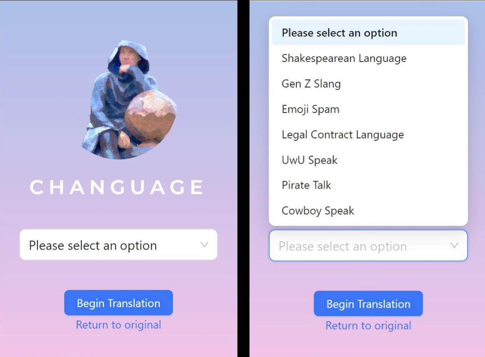

<div align="center">
  <h2>Changuage</h2>
    <p align="center"><i>
        Convert any website into readable, more fun text
        </i><br />
        <br />
        <a href="https://devpost.com/software/changuage">Devpost</a>
        ·
        <a href="https://github.com/g-tejas/Changuage/issues">Report Bug</a>
        ·
        <a href="https://github.com/g-tejas/Changuage/issues">Request Feature</a>
    </p>
</div>




"Hark, good sirs and madams, 'tis us, NUSCTEA, who doth speak. Allow us to extol the virtues of our new creation, a chrome extension which harnesses the power of GPT-3 API. 'Tis a tool of unmatched versatility and convenience, capable of converting the text on any webpage thou dost visit into the language of thy choosing, be it the flowery tongue of Shakespeare or the whimsical UwU speak. 'Tis a true marvel of technology and a boon for any lover of language. Trust in its abilities and thou shalt not be disappointed. In short, 'tis a chrome extension worthy of thy patronage."


Clone it and try it out!

## Usage

```bash
# install dependcy
npm i
# development
npm run dev
# build
npm run build
```

## Credits

Changuage was created within 24 hours by Cheng-Yu, Eric, Archit and Tejas for the 2023 Hackathon hosted at NUS College.
